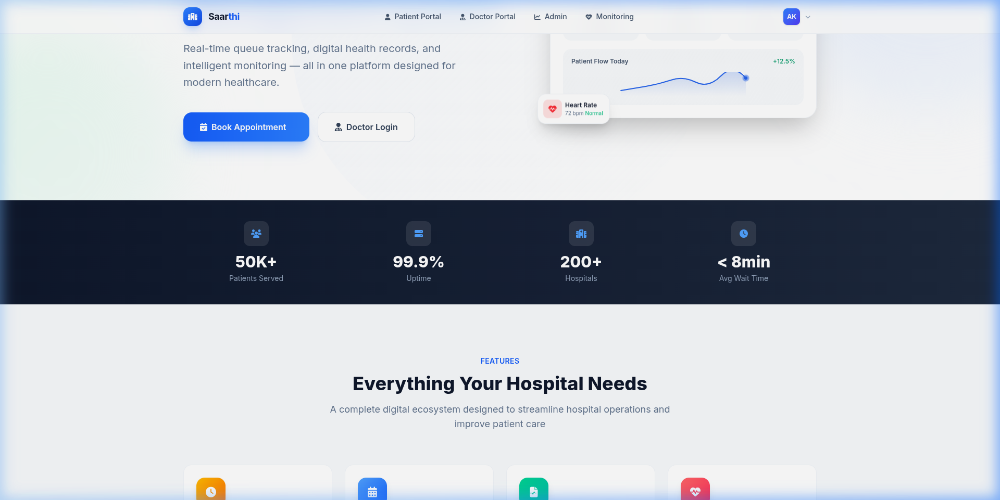
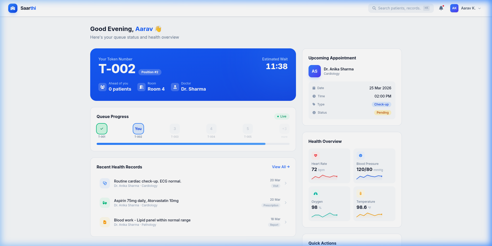
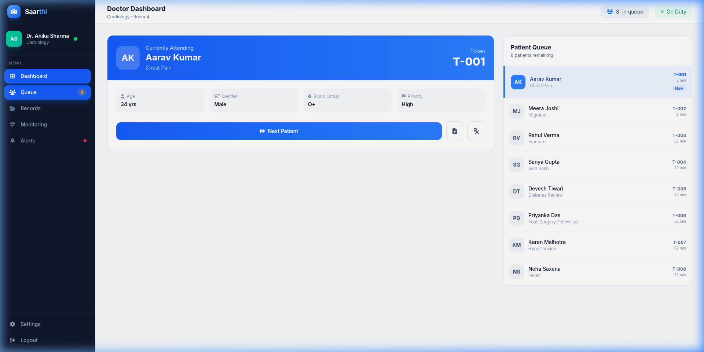
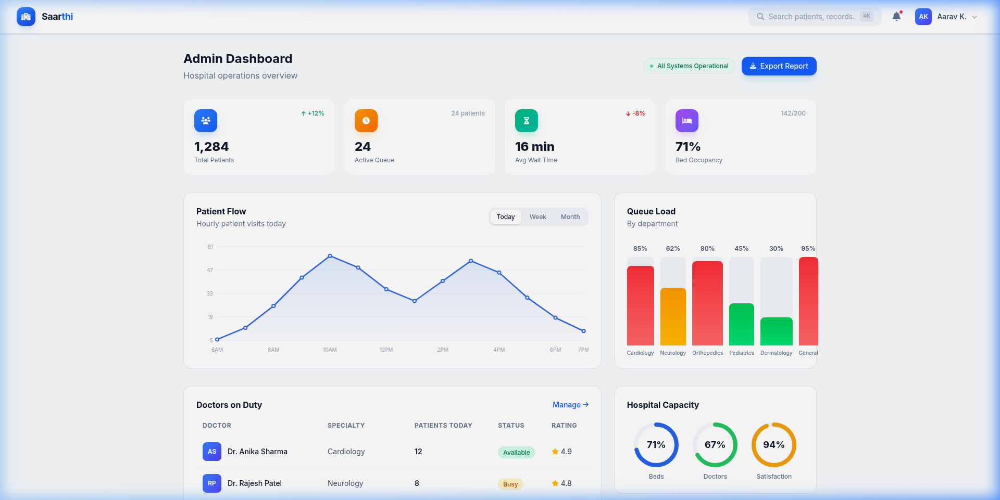
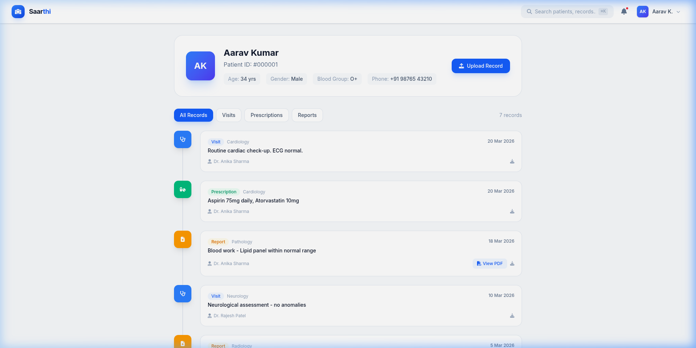
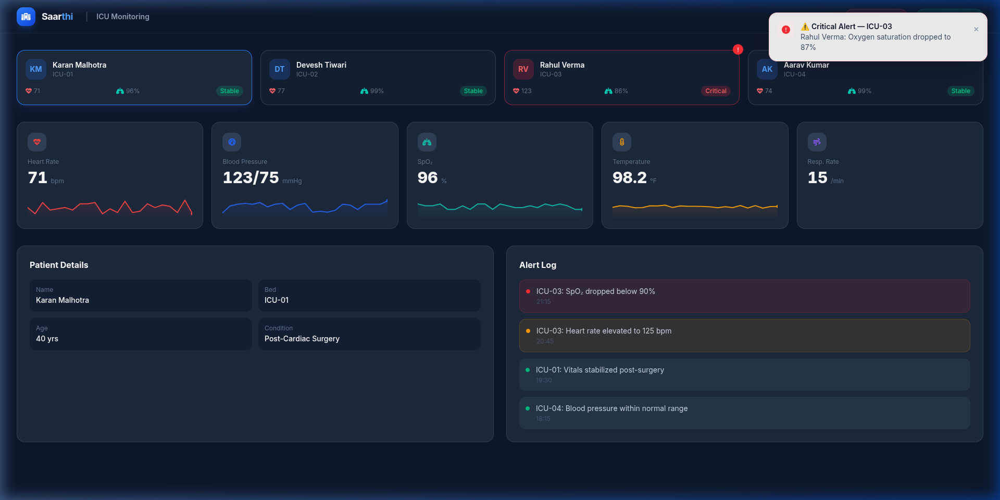

# 🏥 Saarthi | Smart Hospital Management System

**Saarthi** is an intelligent Hospital Management System (HMS) designed to bridge the gap between patients, doctors, and administrators through real-time data sync, predictive queuing, and centralized health records.

Developed by **Team: The Dev Circle** for **HackMol 7.0**, this project exists as a **high-fidelity feature prototype** that demonstrates the complete end-to-end vision of modern, digitized healthcare.

---

## 👥 Team: The Dev Circle
- **Jasdeep Singh** (Lead)
- **Mantej Singh**
- **Manmohan Singh**
- **Sehaj Singh**

*Guru Nanak Dev Engineering College, Ludhiana, Punjab.*

---

## ❗ The Problem (HackMol 7.0 Case Study)
Hospitals today face critical challenges that lead to inefficiency and compromised patient care:
1.  **Fragmented OPD Experience**: Unpredictable wait times (often 2-3 hours) and overcrowded clinics.
2.  **Disconnected Medical History**: Patients lose reports; doctors lack historical insights, leading to redundant tests.
3.  **Monitoring Gaps**: No real-time vital tracking for doctors, leading to reactive instead of proactive emergency care.

---

## 🌟 The Solution: Saarthi
Saarthi transforms the hospital journey through three core pillars:
- **Real-time Queue Management**: Dynamic token allocation and live ETA tracking.
- **Unified Digital Health Records (EHR)**: Secure, centralized, and timeline-based history.
- **ICU-Grade Monitoring**: Live vitals streaming with threshold-based smart alerts.

---

## 📸 Project Walkthrough

### 1. Landing Page
The gateway featuring a live system status overview and the core workflow: Check-in → Queue → Consultation → Follow-up.


### 2. Patient Dashboard
Live token status (`T-002`), current position, and a real-time countdown to the consultation.


### 3. Doctor Dashboard
A high-efficiency view to manage the patient queue, view urgency flags (High/Medium/Low), and navigate patient history.


### 4. Admin & Operations
Analytics for hospital managers: Patient flow trends, department-wise load, and bed occupancy rates.


### 5. Health Records & Monitoring
Comprehensive tracking of patient history and real-time vital signs monitoring with interactive sparklines.



---

## 🏗 Prototype Implementation vs. Vision
This repository contains a **fully functional prototype** that demonstrates the logic and UI/UX flows outlined in our ideation PPT.

| Feature from PPT | Implementation in Prototype | Mechanics |
| :--- | :--- | :--- |
| **Real-Time Queue Tracking** | **Implemented (Live Sync)** | Uses React `useEffect` and `setInterval` to simulate constant server-client sync for token updates. |
| **Dynamic ETA Prediction** | **Implemented (Rule-Based)** | A calculation engine in the frontend estimates wait time based on queue length and avg. consultation duration. |
| **Digital Health Records** | **Implemented (Timeline)** | A centralized JSON-based state (`data.js`) stores history, accessible via a timeline-based UI. |
| **Live Vitals Monitoring** | **Implemented (Simulated IoT)** | Real-time vital signs (HR, BP, SpO2) are streamed using a simulated data pipeline and rendered with SVG sparklines. |
| **Threshold-Based Alerts** | **Implemented (Smart Alerts)** | A rule engine evaluates vitals against predefined thresholds to trigger instant "Distress Signals" (Toasts). |
| **RBAC (Role Based Access)** | **Implemented (Multi-Panel)** | Separate dashboards with specialized permissions for Patients, Doctors, and Admin roles. |

---

## 🛠 Tech Stack

### Current Prototype
- **Frontend**: React 19, Vite, Tailwind CSS 4, Framer Motion
- **State/Real-time**: Context API + Simulated WebSocket streams
- **Charts**: Custom SVG Sparklines & Lightweight Analytics components
- **Styling**: Modern "Glassmorphic" CSS with vibrant, professional palettes

### Production Roadmap (Full Stack)
- **Backend**: Node.js + Express.js, Socket.io (for real-time WebSockets)
- **Database**: MongoDB (Structured EHR data), Redis (Caching queue status)
- **Storage**: AWS S3 / Cloudinary (Medical reports & images)
- **AI/Logic**: Threshold rule engine, OpenAI/Gemini API for clinical insights
- **IoT**: MQTT protocol for actual medical sensor integration

---

## 📂 Project Structure

```text
src/
├── components/      # UI components (Navbar, Toast, Charts, Sidebar)
├── pages/           # Landing, Dashboards, Monitoring, Records, Notifications
├── data.js          # Core simulation data & patient database
├── App.jsx          # Route definitions
└── main.jsx         # Entry point
```

---

## 💻 Getting Started

1. **Install dependencies**: `npm install`
2. **Launch Developer Server**: `npm run dev`
3. **Open Access**: `http://localhost:5173`

---

## 🛡 Security & Reliability
Designed for high uptime (99.9%) and zero-lag interactions. Our prototype demonstrates a **resilient UI** that handles data fluctuations gracefully.

---

*Saarthi - Making Healthcare Smarter | Created for HackMol 7.0*
